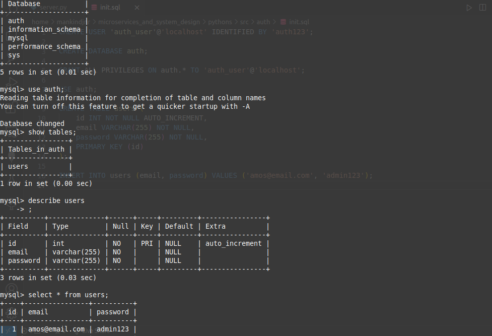

## EVERYTHING AUTH WITH FLASK AND MYSQL
### Building the API gateway

After our server configuration is done, we create a login route that uses basic authentication.

When the user tries to access the application they will have to go through the api gateway, the api gateway will require authentication, the user will either have to login and register to get a jwt token. The user will then use the jwt token to access the applicationand its services.

The jwt token will contain the username and the expiry date of the token. We wiil also include in the payload, the admin status of the user. This will help us to restrict access to certain services to only admin users.


`server.run(debug=True, host="0.0.0.0", port=5000)` we are setting host to 0.0.0.0 becase we want to be able to access the server from outside the container.

our flask application will be running inside a docker container, the docker container will have its own ip address, if we set we dont set the host to 0.0.0.0, we will not be able to access the server from outside the container. We will only be able to access the server from inside the container. 

The 0.0.0.0 tells our operating system to listen to all public ip addresses on the machine.

***
***
# EXPLANATION
Every server has an ip address that other services can access it from the outside. Our server is a docker container and our application will be running inside that container.

When we spin up our docker container, it will be assigned an ip address and we can use that ipa address to send reqest to that container (our current server). But that does not allow our flask application to receive those requests, we have to tell our flask application to listen to all public ip addresses on the machine. We do that by setting the host to 0.0.0.0. By doing so, we are telling the flask application to listen to the ip address of the docker container - the host ip address.

so, when we set `server.run(debug=True, host="0.0.0.0", port=5000)` we are telling the flask application that the server is 0.0.0.0, the machine we are in.

We could set the host to a specific docker container but docker ip are set to change often, so the static ip wont be ideal.

***
***
```python
@server.route("/login", methods=["POST"])
def login():
    auth = request.authorization # get the authorization header (username, password)
    if not auth:
        return "Missing credentials", 401

    # check database for username and password
    cur = mysql.connection.cursor()
    result = cur.execute("SELECT * FROM users WHERE email = %s", (auth.username))

    if res > 0:
        # then user exists in the database
        user_row = cur.fetchone()
        email = user_row[0]
        password = user_row[1]

        if auth.username != email or auth.password != password:
            return "Invalid credentials", 401
        else:
            # create a jwt token
            return createJWT(auth.username, os.environ.get("JWT_SECRET"))

    else:
        return "Invalid credentials", 401
```

We are using the `request.authorization` to get the username and password from the request header. We then check the database for the username and password. If the username and password are correct, we create a token and return it to the user.

### setting up the database - auth table
### init.sql
```sql
CREATE USER 'auth_user'@'localhost' IDENTIFIED BY 'auth123';

CREATE DATABASE auth;

GRANT ALL PRIVILEGES ON auth.* TO 'auth_user'@'localhost';

USE auth;

CREATE TABLE users (
    id INT NOT NULL AUTO_INCREMENT,
    email VARCHAR(255) NOT NULL,
    password VARCHAR(255) NOT NULL,
    PRIMARY KEY (id)
);

INSERT INTO users (email, password) VALUES ('amos@email.com', 'admin123');
```

- CREATE USER - create a user with the username `auth_user` and password `auth123`

- CREATE DATABASE - create a database called `auth`

- GRANT ALL PRIVILEGES - give the user `auth_user` all privileges on the database `auth` AND all tables in that database

- USE - use the database `auth`

- CREATE TABLE - create a table called `users` with the columns `id`, `email`, and `password`

- INSERT INTO - insert a row into the table `users` with the values `email` and `password` - here we are creating our test user.

```bash
mysql -uroot
mysql -uroot < init.sql
show databases;
use auth;
show tables;
describe users;
select * from users;
```

- mysql -uroot -we are using the default root user to connect to the database

- mysql -uroot < init.sql - we are using the default root user to connect to the database and we are passing the init.sql file to the mysql command. The `<` is a redirect operator that redirects the contents of the file to the command.

- show databases - show all the databases in the mysql server
- use auth - use the database `auth`
- show tables - show all the tables in the database `auth`
- describe users - describe the table `users`
- select * from users - select all the rows from the table `users` -> _this will show us the test user we created._



With the login route done, we are creating the `createJWT` AND `validateJWT` functions.

With that, the auth is done and now we are going to work on our infrastructure code for deployment. Our application is going to be deployed in a kubernetes cluster, we are going to use minikube to create our cluster.

For this, we are going to create docker images that we push to our repository and then kubernetes will pull those images and create our deployments to our cluster.

==> infrastructure.md
