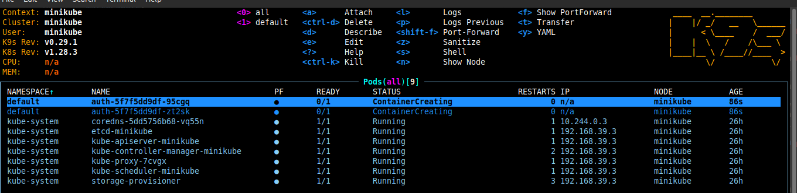
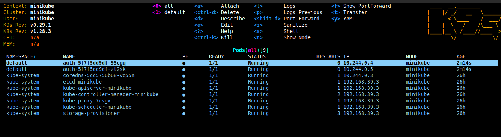
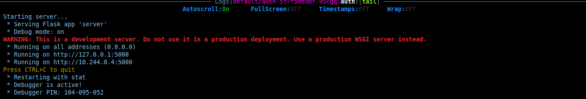

# INFRASTRUCTURE CODE
### KUBERNETES CLUSTER | DOCKER 

First we create a docker image for our flask app. We will use this image to create a deployment in our kubernetes cluster.

```dockerfile
FROM python:3.10-slim-bullseye

RUN apt-get update \
    && apt-get install -y --no-install-recommends --no-install-suggests \
    build-essential default-libmysqlclient-dev pkg-config \
    && pip install --no-cache-dir --upgrade pip

WORKDIR /app
COPY ./requirements.txt /app
RUN pip install --no-cache-dir --requirement /app/requirements.txt
COPY . /app

EXPOSE 5000

CMD ["python", "server.py"]
```

- `FROM python:3.10-slim-bullseye` we are using the python 3.10 slim image, the slim image is a smaller version of the python image, it does not have all the packages that the python image has. We are using the slim image because we dont need all the packages that the python image has.

__OS DEPENDENCIES__
- `RUN apt-get update \ && apt-get install -y --no-install-recommends --no-install-suggests \ build-essential default-libmysqlclient-dev \ && pip install --no-cache-dir --upgrade pip` we are installing the mysql client, we will use it to connect to our mysql database.

__--no-install-recommends --no-install-suggests__ we are telling apt-get to not install any recommended or suggested packages. Also, we are using the `\` to tell docker that the command is not finished yet, it should continue to the next line.
__build-essential__ we are installing the build-essential package, it contains all the packages that are needed to build a debian package.
__default-libmysqlclient-dev__ we are installing the mysql client, we will use it to connect to our mysql database.
__pip install --no-cache-dir --upgrade pip__ we are upgrading pip to the latest version. __--no-cache-dir__ we are telling pip to not cache the downloaded packages. 

__All this is to ensure that the image is as small as possible.__

```bash
docker build .
```

once the build is done, head to the docker hub and create a new repository, then push the image to the repository.

Before pushing:

- tag the image with the name of the repository you created in docker hub
```bash
docker tag 74b4e6243219 mankindjnr/auth:latest
```

- push to repository
```bash
docker push mankindjnr/auth:latest
```

- how to pull the image
```bash
docker pull mankindjnr/auth:latest
```

But at the moment we are not going to be pulling this way since the kubernetes cluster will be pulling the image from the repository.

### Kubernetes configuration

mkdir manifests

 - auth-deloy.yaml

This is the file that will be used to create a deployment in our kubernetes cluster.
In it, it pulls the image from the docker hub repository, and creates a deployment with 2 replicas.

```yaml
apiVersion: apps/v1
kind: Deployment
metadata:
  name: auth
  labels:
  app: auth

spec:
  replicas: 2
  selector:
    matchLabels:
      app: auth
    strategy:
      type: RollingUpdate
      rollingUpdate:
        maxSurge: 3
    template:
      metadata:
        labels:
          app: auth
      spec:
        containers:
          - name: auth
            image: mankindjnr/auth
            ports:
              - containerPort: 5000
            envFrom:
              - configMapRef:
                  name: auth-configmap
              - secretRef:
                  name: auth-secret
```
The image contains our code and all the dependencies that we need to run our app.
All the files in the manifests folder will interface with the kubernetes api - api for or kubernetes cluster. They will create our serviice.

```bash
cd manifests

kubectl apply -f ./
```

After all the changes hav been applied, we can check the status of our pods.
Remember that we created a deployment with 2 replicas, so we should see 2 pods.

```bash
minikube start
k9s
```



press enter on the pods, then the containers, then the logs. You will see the logs of the container.



we can use the inbuilt shell, click the pods and press `s` to open the shell.
`exit` to exit the shell and
`esc` to move back to the pods.

in the shell, you are directed to the working directory as specified in the dockerfile. and yourr code is in the working directory.


===> Done with the infrastructure, now we can move to the application code.
1st ==> gateway

